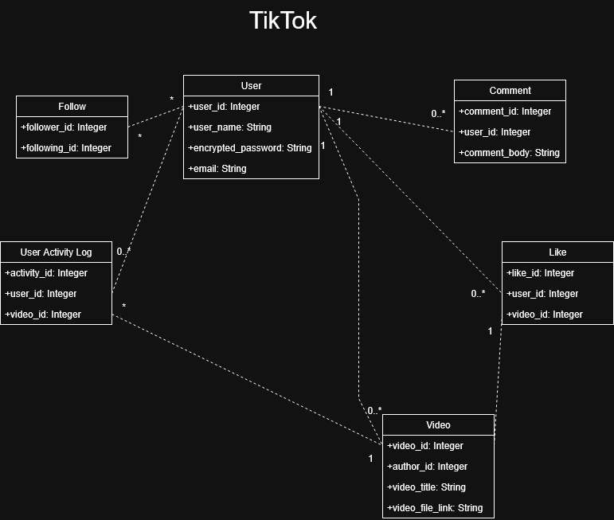
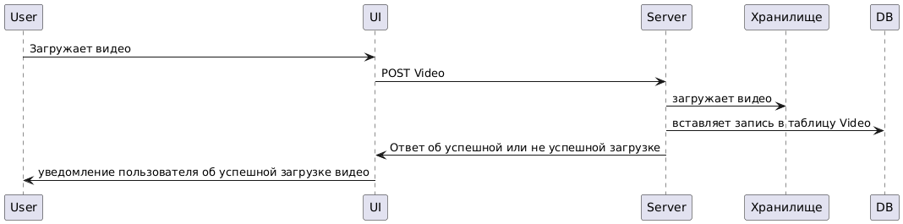

# Документация для аналога TikTok

В данном readme файле описана структура и кратко изложены аналитические фрагменты приложения для просмотра коротких видео, похожего на tiktok.

# 1. Диаграммы
<details>
  <summary>Диаграммы (нажмите, чтобы вскрыть)</summary>

- Диаграмма классов (diagrams.net)

  

- Sequence диаграмма (plantUML)

  

</details>

# 2. Запросы для работы с БД
<details>
  <summary>Создание таблицы (нажмите, чтобы вскрыть)</summary>

```sql
-- Таблица пользователей
CREATE TABLE User (
    user_id SERIAL PRIMARY KEY,
    user_name VARCHAR(255) NOT NULL,
    password_hash VARCHAR(255) NOT NULL,
    email VARCHAR(255) UNIQUE NOT NULL
);

-- Таблица видео
CREATE TABLE Video (
    video_id SERIAL PRIMARY KEY,
    author_id INTEGER NOT NULL,
    video_title VARCHAR(255),
    video_file_link VARCHAR(255),
    FOREIGN KEY (author_id) REFERENCES User(user_id)
        ON DELETE CASCADE
);

-- Таблица с подписками
CREATE TABLE Follow (
    follower_id INTEGER NOT NULL,
    following_id INTEGER NOT NULL,
    PRIMARY KEY (follower_id, following_id),
    FOREIGN KEY (follower_id) REFERENCES User(user_id)
        ON DELETE CASCADE,
    FOREIGN KEY (following_id) REFERENCES User(user_id)
        ON DELETE CASCADE
);

-- Таблица лайков видео
CREATE TABLE Like (
    like_id SERIAL PRIMARY KEY,
    user_id INTEGER NOT NULL,
    video_id INTEGER NOT NULL,
    FOREIGN KEY (user_id) REFERENCES User(user_id)
        ON DELETE CASCADE,
    FOREIGN KEY (video_id) REFERENCES Video(video_id)
        ON DELETE CASCADE
);

-- Таблица комментариев
CREATE TABLE Comment (
    comment_id SERIAL PRIMARY KEY,
    user_id INTEGER NOT NULL,
    video_id INTEGER NOT NULL,
    comment_body VARCHAR(255),
    FOREIGN KEY (user_id) REFERENCES User(user_id)
        ON DELETE CASCADE,
    FOREIGN KEY (video_id) REFERENCES Video(video_id)
        ON DELETE CASCADE
);

-- Таблица активности пользователя
CREATE TABLE UserActivityLog (
    activity_id SERIAL PRIMARY KEY,
    user_id INTEGER NOT NULL,
    video_id INTEGER NOT NULL,
    FOREIGN KEY (user_id) REFERENCES User(user_id)
        ON DELETE CASCADE,
    FOREIGN KEY (video_id) REFERENCES Video(video_id)
        ON DELETE CASCADE
);
```
</details>

## Аналитические SQL-запросы

<details>
  <summary>Примеры с работой с данными (нажмите, чтобы вскрыть)</summary>

  - Получить таблицу всех пользователей с количеством опубликованных видео и отсортировать.

  ```sql
  SELECT user_id, user_name, COUNT(Video.video_id) as videos_count
  FROM User LEFT JOIN Video ON User.user_id = Video.author_id
  GROUP BY User.user_id, User.user_name
  ORDER BY videos_count DESC;
  ```

  - Список пользователей, которые подписаны на пользователя с id 322.

  ```sql
  SELECT user_id, user_name
  FROM User JOIN Follow ON User.user_id = Follow.follower_id
  WHERE following_id = 322;
  ```

  - Список пользователей, на которых подписан пользователь с id 322.

  ```sql
  SELECT user_id, user_name
  FROM User JOIN Follow ON User.user_id = Follow.following_id
  WHERE follower_id = 322;
  ```
</details>
